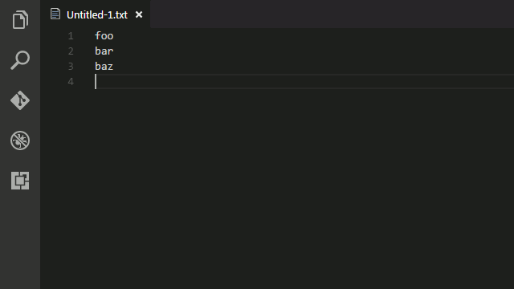

# Ensure Single Final Newline for VS Code

[](https://travis-ci.org/jmlntw/vscode-ensure-single-final-newline)
[](https://ci.appveyor.com/project/jmlntw/vscode-ensure-single-final-newline/branch/master)
[](https://david-dm.org/jmlntw/vscode-ensure-single-final-newline?type=dev)

This is a [Visual Studio Code](https://code.visualstudio.com/) extension that ensures all files end with a single new line.

## Features

This extension removes extra newlines at the end of the file but keeps only one when you save the file.



## Installation

Launch VS Code Quick Open (Ctrl+P), paste the following command, and press enter.

```
ext install vscode-ensure-single-final-newline
```

## Extension Settings

Enable or disable by setting `files.ensureSingleFinalNewline` in VS Code configuration.

```json
{
  "files.ensureSingleFinalNewline": true
}
```

## License

Licensed under the [MIT License](LICENSE.md).
